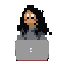

<h1 align="center">  <samp>&gt; Hey There👋, I'm
                <b><a target="_blank" href="https://mariesamantha.dev/">Marie Samantha</a></b>
        </samp>
<h3 align="center">「 A Vancouver-based software developer and ML enthusiast from Indonesia 」</h3>

- Currently a second-year Computer Science student at <a href="https://you.ubc.ca/ubc_programs/computer-science-vancouver-bsc/">The University of British Columbia </a>

- 👨‍💻 All of my projects are available at [https://mariesamantha.dev/](https://mariesamantha.dev/)

- 📄 Get to know more about my experiences through my [Resume](https://drive.google.com/file/d/10P-r2oP9y1EzFj_X4hdWO_bZME_RivA7/view?usp=sharing) !

- ⚡ Fun fact: **I am a lefty :point_left: and I do digital art in my spare time!** (My profile picture is a drawing of my avatar from my favorite childhood video game!)

<h3 align="left">Connect with me:</h3>

<h3 align="left">Top Languages:</h3>

  </a>    

&nbsp;

